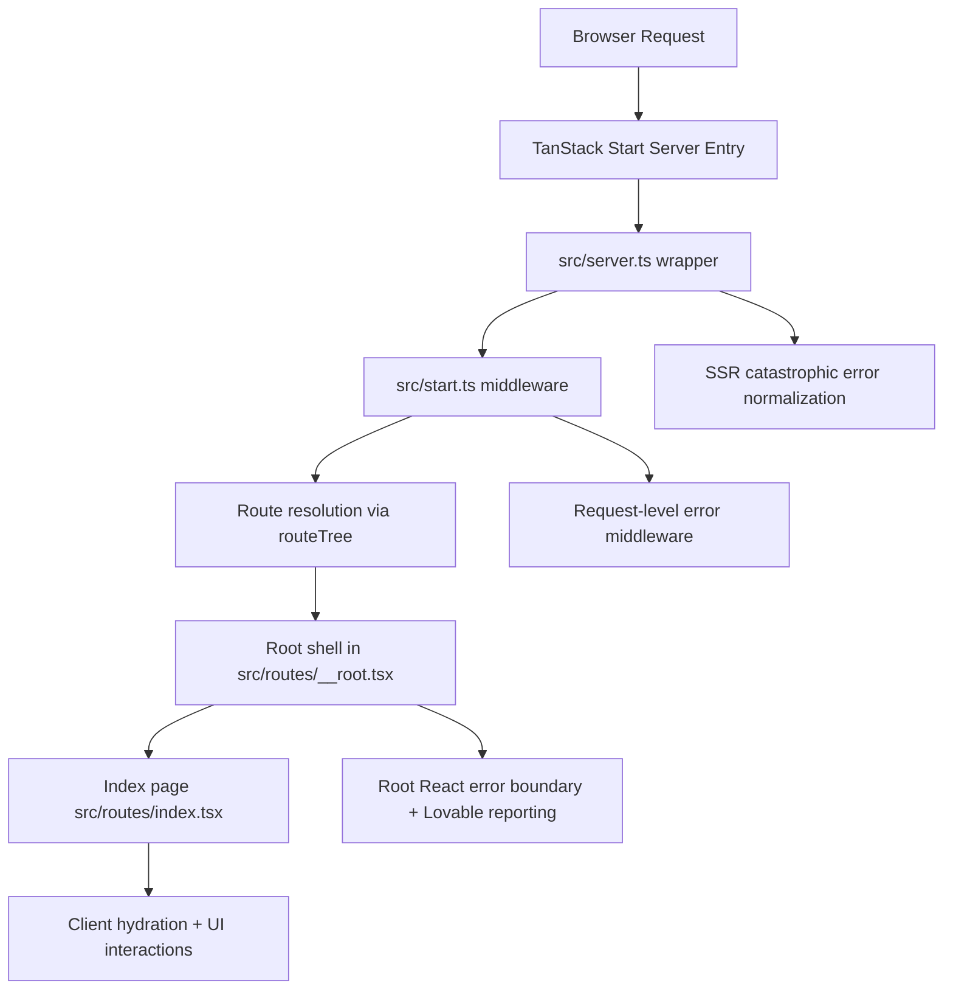

# Muscle Flex Fitness Club Web App

A production-ready marketing website and lead capture system for Muscle Flex Fitness Club built with TanStack Start, React 19, TypeScript, Supabase, and Tailwind CSS v4.

The app is a server-rendered single-page route (`/`) with section-based navigation, rich UI components, and a contact flow that hands users to WhatsApp.

## Features

- Brand-focused landing page with sections for Hero, About, Services, Membership, Gallery, Testimonials, FAQ, Contact, and Footer.
- Responsive top navigation with scroll state and mobile menu toggle.
- Animated reveal-on-scroll interactions using `IntersectionObserver` (`useReveal` hook).
- Media-heavy gallery and hero imagery with defensive image fallback behavior.
- Contact form that validates on the client and submits to a server-side lead capture API.
- Floating WhatsApp chat button (FAB) available throughout the page.
- Embedded Google Maps location in the Contact section.
- SEO metadata and social tags (Open Graph + Twitter metadata).
- Structured data (`HealthClub` JSON-LD) for search engines.
- Custom 404 page and robust SSR/runtime error boundaries.

## Architecture

### High-level

- Framework: TanStack Start (full-stack React app framework).
- Rendering: SSR-capable app shell with route-based rendering.
- Routing: File-based routing from `src/routes`.
- State: Local React state for UI interactions; TanStack Query client is provisioned globally.
- Styling: Tailwind CSS v4 + custom design tokens and utility classes in `src/styles.css`.

### Runtime flow



### Folder overview

- `src/routes/__root.tsx`: App shell, global metadata links, not found component, root error boundary.
- `src/routes/index.tsx`: Main marketing page and all page sections/components.
- `src/router.tsx`: Router creation and QueryClient context wiring.
- `src/start.ts`: TanStack Start middleware with server error handling.
- `src/server.ts`: Server entry wrapper and SSR catastrophic error normalization.
- `src/lib/lead-schema.ts`: Shared lead validation schema used by client and server.
- `src/lib/supabase-server.ts`: Server-only Supabase client using the service role key.
- `src/lib/error-capture.ts`: Captures global errors/rejections for diagnostics.
- `src/lib/error-page.ts`: Fallback HTML error page renderer.
- `src/lib/lovable-error-reporting.ts`: Optional bridge to Lovable error events.
- `src/styles.css`: Tailwind imports, theme variables, and component utility classes.
- `src/components/ui/*`: Reusable UI primitives (Radix/shadcn-style components).

## Frontend Stack

- React 19 + TypeScript
- TanStack Start + TanStack Router + TanStack Query
- Supabase for lead storage
- Tailwind CSS v4
- Lucide icons
- shadcn/Radix-style UI component set
- Sonner toast system (`src/components/ui/sonner.tsx`)

## Integrations

### 1) Lead capture integration

- Contact form submits to `POST /api/contact`.
- Server middleware validates, sanitizes, rate limits, and stores leads in Supabase.
- The service role key is server-only and never exposed to the browser.
- Client feedback is handled with loading state, inline field errors, and Sonner toasts.

Required Supabase table fields:

```sql
create table if not exists public.leads (
   id uuid primary key default gen_random_uuid(),
   full_name text not null,
   email text not null,
   phone text not null,
   message text,
   preferred_plan text,
   source text,
   utm_source text,
   utm_medium text,
   utm_campaign text,
   page_url text,
   referrer text,
   status text not null default 'new',
   created_at timestamptz not null default now()
);

alter table public.leads enable row level security;

create policy "Admins can manage leads"
on public.leads
for all
to authenticated
using (auth.jwt() ->> 'role' = 'admin')
with check (auth.jwt() ->> 'role' = 'admin');

create policy "Deny public lead access"
on public.leads
for select
to anon, public
using (false);

create policy "Deny public lead updates"
on public.leads
for update
to anon, public
using (false)
with check (false);
```

Important:
- Inserts should come only from server-side code using the Supabase service role key.
- Manage leads initially from the Supabase dashboard.
- If you want stricter admin control later, add a dedicated admin auth/role model before exposing a custom dashboard.

### 2) WhatsApp click-to-chat integration

- Configured as a deep link (`https://wa.me/...`) in `src/routes/index.tsx`.
- Also exposed via footer social icon and floating WhatsApp FAB.

Important:
- This is not WhatsApp Business API.
- No webhook handling, message status callbacks, or bot automation are implemented.

### 2) Google Maps embed integration

- Contact section renders a Google Maps `iframe` embed and sends page/referrer analytics with lead submissions.
- No map SDK is used at runtime in the current page implementation.

### 3) Google Fonts integration

- Fonts are loaded in root route head via `<link rel="stylesheet" ...>`.
- Families currently include Bebas Neue, Oswald, and Inter.

### 4) Lovable platform integration

- Build setup uses `@lovable.dev/vite-tanstack-config`.
- Root error boundary reports errors through `window.__lovableEvents` if present.
- Repository includes `AGENTS.md` guidance related to Lovable history safety.

### 5) SEO + structured data

- Open Graph and Twitter metadata set in route heads.
- JSON-LD schema (`HealthClub`) included on the home page.

## Backend and Server Information

Although this project is mostly a marketing frontend, it has backend runtime behavior through TanStack Start SSR.

### Server runtime

- Entry point is wrapped by `src/server.ts`.
- Custom handling detects certain catastrophic SSR responses and replaces them with a friendly error page.
- `src/start.ts` adds request middleware to catch server-side failures and return controlled HTML error output.

### Error handling layers

- Client/route boundary: `errorComponent` in `src/routes/__root.tsx`.
- Request middleware boundary: `src/start.ts`.
- SSR catastrophic response normalization: `src/server.ts` + `src/lib/error-capture.ts`.

### Current backend capabilities

- SSR rendering and middleware execution.
- No custom API routes implemented yet.
- No database configured.
- No authentication/authorization configured.
- No queueing, caching, or background workers configured.

### Deployment notes

- Vite config is delegated to Lovable TanStack config.
- Comments in `vite.config.ts` indicate Nitro build support with Cloudflare as default target in that preset.

## Scripts

- `npm run dev`: Start local development server.
- `npm run build`: Build client and SSR bundles.
- `npm run build:dev`: Build in development mode.
- `npm run preview`: Preview production build.
- `npm run lint`: Run ESLint.
- `npm run format`: Run Prettier formatting.

## Environment Variables

Set these in your server environment:

- `SUPABASE_URL`
- `SUPABASE_SERVICE_ROLE_KEY`

## Local Setup

1. Install dependencies:

   `npm install`

2. Start dev server:

   `npm run dev`

3. Build for production:

   `npm run build`

`SUPABASE_URL` and `SUPABASE_SERVICE_ROLE_KEY` are required for lead capture.

## Dependency Notes

- `leaflet`, `react-leaflet`, and `@types/leaflet` are present in dependencies.
- The current home page uses a Google Maps iframe, not Leaflet components.

## Known Functional Limits

- Contact form now submits to the server and stores leads in Supabase.
- Social links for Instagram/Facebook are placeholders (`#`) in the footer.
- Pricing is not embedded as fixed values; plans prompt users to enquire.

## Suggested Next Backend Enhancements

- Add `/api/contact` endpoint for lead capture to DB/CRM.
- Store enquiries with timestamp/source and optional consent metadata.
- Add automated notifications (email/SMS/WhatsApp Business API) from server side.
- Add admin dashboard for lead management.
- Add analytics event tracking for CTA clicks and section engagement.
